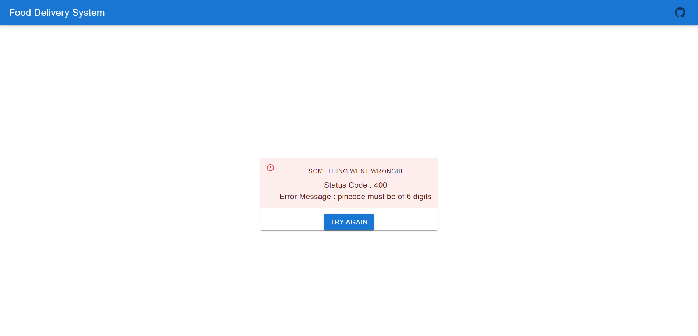
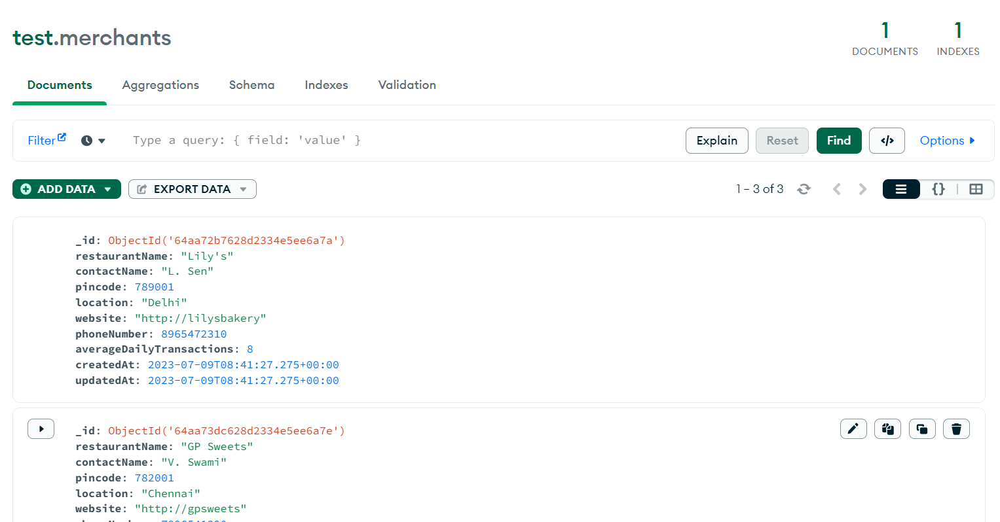

# Food-Delivery-System

Technical Assignment - Vymo

## Installation

### fds-client - UI

1. Make sure you are in the fds-client folder.
2. Use the command `npm install` to install all the dependencies.
   - React Libraries used : **Material UI, Redux ToolKit, Material UI Icons**
3. Add the `.env` file with the following:
   - `REACT_APP_API_BASE_URL` = API for connecting to backend server.
     For local connection ,
      
     `REACT_APP_API_BASE_URL = 'http://localhost:5000'`
   - `REACT_APP_API_VERSION = v1` (by default)
   - `REACT_APP_GITHUB_LINK` = _link to this github codebase_
4. Use the command `npm start` to start the UI

### fds-server - Backend

1. Make sure you are in the fds-server folder.
2. Use the command `npm install` to install all the dependencies.
   - Libraries used : **cors, express, mongoose, dotenv**
3. Add the `.env` file with the following:
   - `MONGODB_URL` = URL for connecting to mongoDb database.
     For local connection ,
      
     `MONGODB_URL = 'mongodb://localhost:27017'`
   - `API_VERSION = v1` (by default)
   - `PORT = 5000`
4. Use the command `nodemon start` to start the server

### How the code works

1. Upon succesfully filling the form with correct details, a POST request is made through CORS to the database, with the form details in JSON body format.
    
   `*Schema:* {"restaurantName: <String>,
    "contactName": <String>, "pincode": <Number>,"location": <String>, "website": <String>, "phoneNumber": <Number>, "averageDailyTransaction": <Number>
}`

2.  Backend API for POST :

    - `localhost:5000/api/v1/register`
    - form details in JSON body
    - throws error if form validation is not passed for each of the details
    - also throws error if form details are already present

3.  MongoDB collection example:

        `{"\_id": {"$oid": "64aa72b7628d2334e5ee6a7a"},"restaurantName": "Lily's","contactName": "L. Sen", "pincode": 789001, "location": "Delhi","website": "http://lilysbakery", "averageDailyTransactions": 8,"createdAt": {"$date": "2023-07-09T08:41:27.275Z"},"updatedAt": {
            "$date": "2023-07-09T08:41:27.275Z"}}`

    
